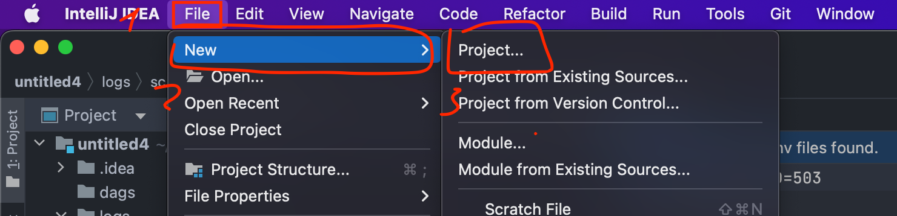

# Run locally (official doc) (15 m)

[https://airflow.apache.org/docs/apache-airflow/stable/howto/docker-compose/index.html](https://airflow.apache.org/docs/apache-airflow/stable/howto/docker-compose/index.html)

1. Open IntelliJ IDEA
2. Click **File** → **New** → **Project…**



1. Select **Empty Project**, setup name, and click **Create**


1. Add .gitignore


1. In Terminal run for uploading `./docker-compose.yaml`

```bash
curl -LfO 'https://airflow.apache.org/docs/apache-airflow/2.4.2/docker-compose.yaml'
```


1. Initializing Environment

```bash
mkdir -p ./dags ./logs ./plugins
echo -e "AIRFLOW_UID=$(id -u)" > .env
```


7. Initialize the database

```bash
docker-compose up airflow-init
```

1. After initialization is complete, you should see a message like this:

```bash
airflow-init_1       | Upgrades done
airflow-init_1       | Admin user airflow created
airflow-init_1       | 2.4.2
start_airflow-init_1 exited with code 0
```


1. The account created has the login `airflow` and the password `airflow`


2. Running Airflow

```bash
docker-compose up
```


1. Go to [http://localhost:8080/home](http://localhost:8080/home)


[Cleaning-up the environment](https://www.notion.so/Cleaning-up-the-environment-80d005f00b364c8e956d34f095376f03)